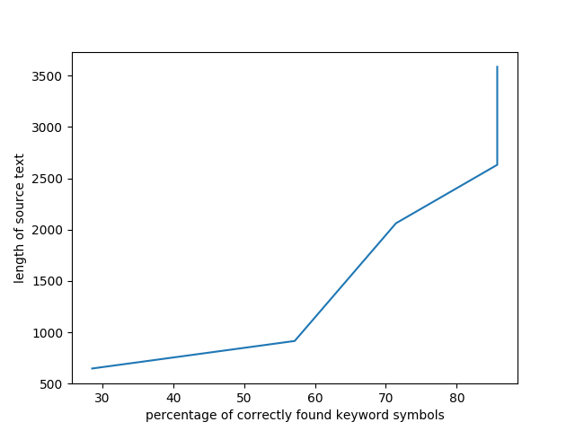
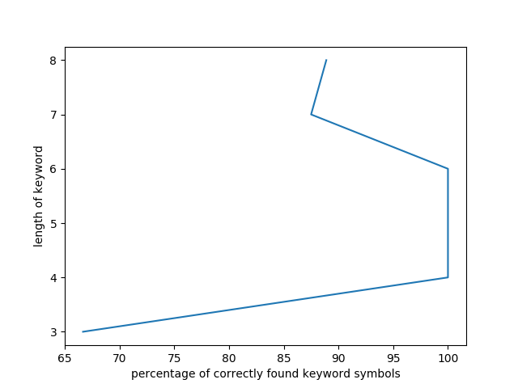

## Report on lab1
by Victoria Drozd, 2nd group
#### Analysis of the dependence of a successful attack by the Kasiski's method **on the length of the source text**
Length of source text | Keyword | Keyword length | Keyword length found | Keyword found | Percentage of correctly found keyword symbols
------------ | ------------- | ------------ | ------------- | ------------ | -------------
648 | century | 7 | 7 | cbiiero | 29%
916 | century | 7 | 7 | dediury | 57%
2062 | century | 7 | 7 | cebtugy | 71%
2631 | century | 7 | 7 | centuhy | 86%
3585 | century | 7 | 7 | centucy | 86%

#### Analysis of the dependence of a successful attack by the Kasiski's method **on the length of a keyword**
Length of source text | Keyword | Keyword length | Keyword length found | Keyword found | Percentage of correctly found keyword symbols
------------ | ------------- | ------------ | ------------- | ------------ | -------------
3585 | get | 3 | 3 | gea | 100%
3585 | meow | 4 | 4 | meow | 71%
3585 | earth | 5 | 5 | earth | 100%
3585 | qwerty | 6 | 6 | qwerty | 86%
3585 | globoid | 7 | 7 | globoid | 100%
3585 | symbolic | 8 | 8 | sytbolic | 86%
3585 | willpower | 9 | 9 | willpvwer | 86%
